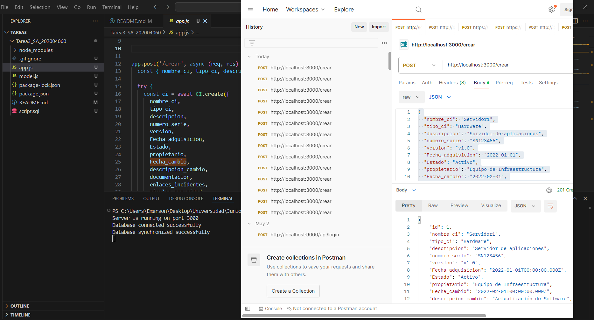
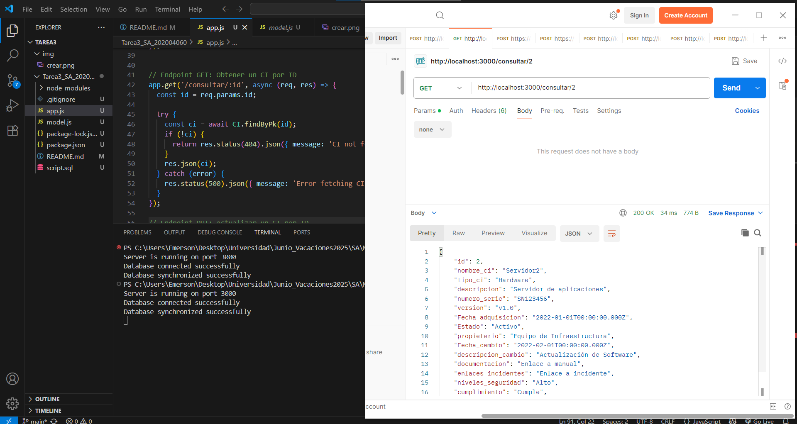
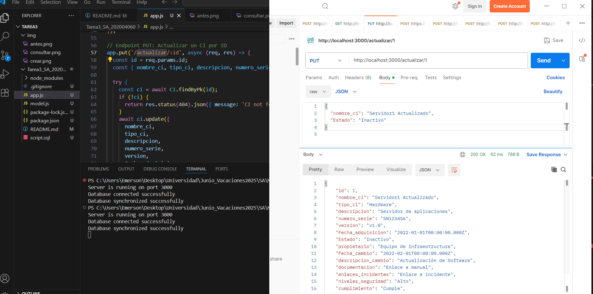
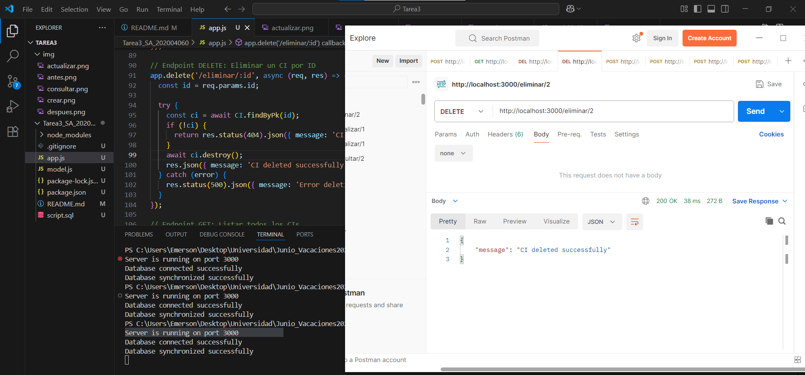
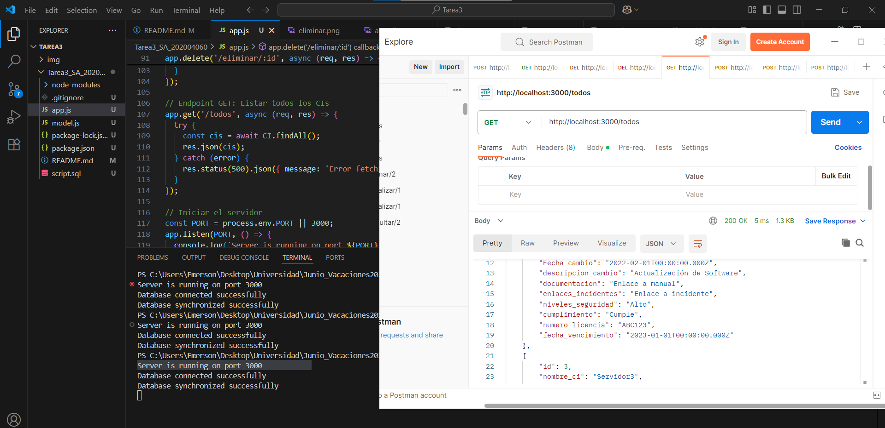
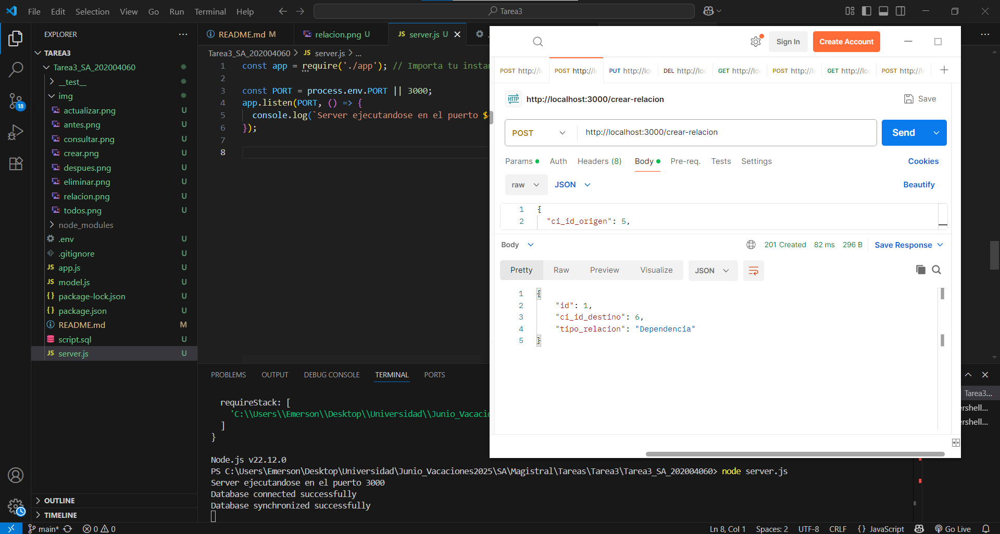
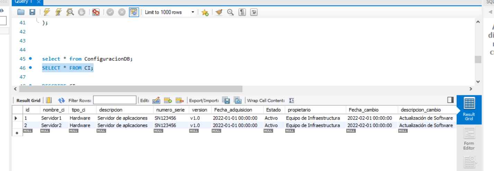
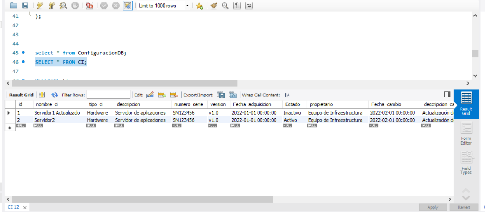
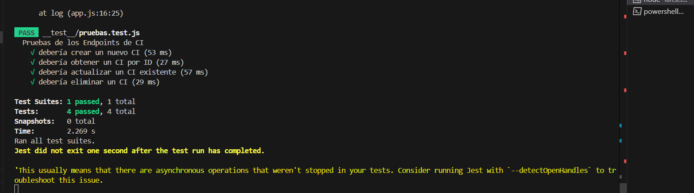
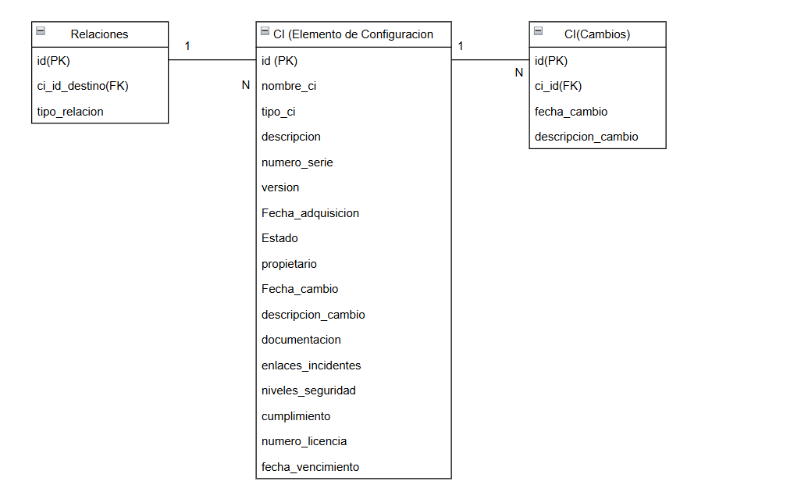

# TAREA 3: Creación de API para CMDB


UNIVERSIDAD DE SAN CARLOS DE GUATEMALA  
FACULTAD DE INGENIERÍA  
ESCUELA DE CIENCIAS Y SISTEMAS    
SOFTWARE AVANZADO Sección P

# Datos 

Gerber Emerson Ordoñez Tucubal - 202004060	


# Documentación de la API - Gestión de CIs

Esta API permite gestionar Elementos de Configuración (CI), sus relaciones y cambios en el sistema.

---

## Endpoints

### Crear CI
**POST** `/crear`

Crea un nuevo CI (Elemento de Configuración).

#### Cuerpo de la solicitud (JSON):
```json
{
  "nombre_ci": "Servidor Aplicaciones",
  "tipo_ci": "servidor",
  "descripcion": "Servidor principal de apps",
  "numero_serie": "SN123456",
  "version": "v1.0",
  "Fecha_adquisicion": "2022-01-15",
  "Estado": "Activo",
  "propietario": "Juan Pérez",
  "Fecha_cambio": null,
  "descripcion_cambio": null,
  "documentacion": "docs.servidor.com",
  "enlaces_incidentes": "incidencia123",
  "niveles_seguridad": "alto",
  "cumplimiento": "ISO27001",
  "numero_licencia": "LIC123",
  "fecha_vencimiento": "2026-01-15",
  "ambiente": "PROD"
}
```



---

### Obtener CI por ID
**GET** `/consultar/:id`

Retorna los datos de un CI específico.

---



###  Actualizar CI
**PUT** `/actualizar/:id`

Actualiza los datos de un CI existente.

#### Cuerpo de la solicitud: igual al de creación.

---




###  Eliminar CI
**DELETE** `/eliminar/:id`

Elimina un CI de la base de datos.


---



### Obtener todos los CIs
**GET** `/todos`

Devuelve una lista completa de todos los CIs.

---


### Crear relación entre CIs
**POST** `/crear-relacion`

Crea una relación entre dos CIs.

#### Cuerpo de la solicitud:
```json
{
  "ci_id_origen": 1,
  "ci_id_destino": 2,
  "tipo_relacion": "Dependencia"
}
```

---


### Obtener relaciones de un CI
**GET** `/ci/:id/relaciones`

Devuelve todas las relaciones donde el CI sea origen o destino.

---

---

### Buscar CIs por filtros
**GET** `/buscar`

Permite buscar CIs por uno o más filtros vía query params:
- `nombre_ci`
- `tipo_ci`
- `estado`
- `fecha_adquisicion`
- `ambiente`

---


---


---

# Resultados
### Inicio



### Final


##  Pruebas
Las pruebas están cubiertas con Jest y Supertest y validan:
- Creación
- Consulta por ID
- Actualización
- Eliminación



## Diagrama ER

